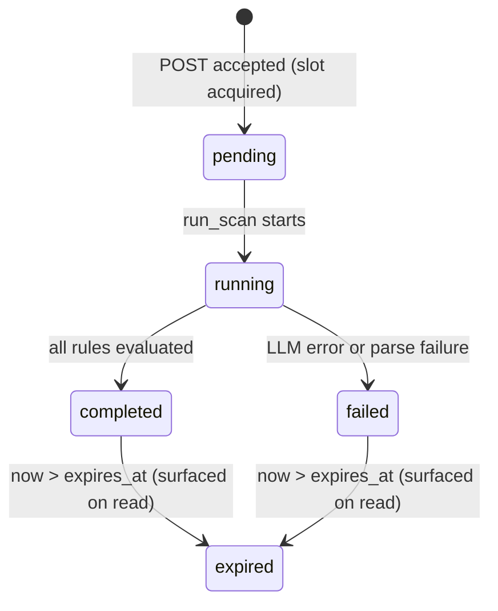

# Code Review Platform - POC Architecture (Refined)

Incorporates all refinements. This document is the authoritative design reference before implementation begins.

---

## Refinements applied

1. `POST /scans` never returns results directly. Cache hit returns `202 + cached: true`; results are always fetched via `GET /scans/{id}`.
2. Cache key covers all output-affecting parameters: `content_hash + ruleset_hash + llm_provider + llm_model + temperature`.
3. Ruleset hash covers enabled rules only, sorted by evaluation order, including: `id`, `name`, `version`, `prompt_template`, `order`.
4. Single-process limitation is a documented constraint, not just a caveat.
5. Background scan tasks open their own DB session; they must never hold or reuse the request session.
6. Expiration is governed by `expires_at`. Expired scans are not reused for cache. `GET` returns `410 Gone` for expired scans. A background sweep deletes expired rows.
7. `GET /health` is a simple liveness check only. Ollama reachability is a separate, optional probe (`/health/ollama`) so a cold Ollama does not make the app appear unhealthy.

---

## Project structure

```
code-review-platform/
  README.md
  pyproject.toml
  .env.example
  rules/
    rules.yaml              # predefined rules (id, name, version, description, prompt_template, enabled, order)
  app/
    main.py                 # FastAPI app + lifespan
    config.py               # pydantic-settings (BaseSettings)
    db.py                   # engine, SessionLocal, get_db dependency
    models.py               # SQLAlchemy ORM: Scan, RuleResult
    schemas.py              # Pydantic DTOs
    rules.py                # load YAML, validate, compute ruleset_hash
    cache.py                # compute_cache_key, lookup_cached_scan
    concurrency.py          # ConcurrencyManager
    scanner.py              # run_scan coroutine (owns its own DB session)
    api/
      __init__.py
      routes.py             # all HTTP endpoints
    llm/
      __init__.py
      base.py               # BaseLLMProvider ABC, RuleVerdict
      ollama_provider.py    # OllamaProvider
      factory.py            # build_provider(settings)
  tests/
    conftest.py
    test_rules.py
    test_cache.py
    test_concurrency.py
    test_scanner.py
    test_api.py
```

---

## API design (refined)

### POST /scans
Multipart upload (`file: UploadFile`).

Request flow:
```
validate (.py, non-empty, <= MAX_FILE_BYTES, ast.parse)
  -> compute content_hash + cache_key
    -> lookup_cached_scan
      [HIT]  -> return 202 {scan_id, status:"completed", cached:true}
      [MISS] -> concurrency_manager.try_acquire()
                  [REJECT] -> 429 {detail: "..."}
                  [ACCEPT] -> create Scan row (status=pending)
                           -> asyncio.create_task(run_scan(...))
                           -> return 202 {scan_id, status:"pending", cached:false}
```

Cache hit deliberately returns `202` (not `200`) to keep the response contract uniform. Clients always follow up with `GET /scans/{id}` regardless of `cached` flag. This is consistent and client-friendly.

### GET /scans/{scan_id}
Returns full scan record + rule results.
- `200`: pending / running / completed / failed
- `410 Gone`: scan exists but `now > expires_at`
- `404`: scan_id unknown

Response shape:
```json
{
  "scan_id": "...",
  "status": "completed",
  "cached": false,
  "file_name": "example.py",
  "created_at": "...",
  "expires_at": "...",
  "error": null,
  "results": [
    {"rule_id": "meaningful_names", "rule_name": "...", "adheres": true, "reason": "..."},
    {"rule_id": "docstring_accuracy", "rule_name": "...", "adheres": false, "reason": "..."}
  ]
}
```

### GET /rules
Returns list of enabled rules (id, name, version, description, order). Useful for API consumers to know what will be checked.

### GET /health
Simple process liveness: `{"status": "ok"}`. Always `200` if the process is running.

### GET /health/ollama
Optional Ollama probe: attempts a lightweight call (e.g. list models). Returns `200` / `503` separately from app health.

---

## Database schema

### `scans`
| Column | Type | Notes |
|---|---|---|
| id | TEXT PK | UUID4 |
| file_name | TEXT | original filename |
| content_hash | TEXT | sha256 of uploaded bytes |
| ruleset_hash | TEXT | sha256 of active ruleset fingerprint |
| llm_provider | TEXT | e.g. "ollama" |
| llm_model | TEXT | e.g. "qwen2.5-coder:7b" |
| llm_temperature | REAL | e.g. 0.0 |
| status | TEXT | pending / running / completed / failed |
| error | TEXT | nullable |
| created_at | DATETIME | |
| updated_at | DATETIME | |
| expires_at | DATETIME | created_at + RESULT_TTL_HOURS |

Composite index on `(content_hash, ruleset_hash, llm_provider, llm_model, llm_temperature, status)` for cache lookups.

### `rule_results`
| Column | Type | Notes |
|---|---|---|
| id | INTEGER PK | autoincrement |
| scan_id | TEXT FK | -> scans.id |
| rule_id | TEXT | |
| rule_name | TEXT | |
| adheres | BOOLEAN | |
| reason | TEXT | LLM explanation |
| created_at | DATETIME | |

---

## Scan status lifecycle



Rejected (429) scans never create a DB row.
Expired is not a stored status — it is derived on read from `expires_at` and returned as `410`.
On startup, any row stuck in `running` or `pending` from a prior crash is marked `failed`.

---

## Ruleset hash definition (refined)

The hash covers only the fields that affect LLM output, for each **enabled** rule, **sorted by evaluation order**:

```
fingerprint = []
for rule in sorted(enabled_rules, key=lambda r: r.order):
    fingerprint.append(f"{rule.id}|{rule.name}|{rule.version}|{rule.prompt_template}")
ruleset_hash = sha256("\n".join(fingerprint))
```

Changing a prompt template, enabling/disabling a rule, reordering rules, or bumping a version all produce a new hash, invalidating prior cache entries. Rule `description` is excluded because it does not affect the LLM call.

---

## YAML rule structure

```yaml
rules:
  - id: meaningful_names
    name: "Meaningful Variable Names"
    version: "1.0"
    description: "All variables should have descriptive, meaningful names."
    prompt_template: |
      You are a code reviewer. Given the following Python code, determine whether
      all variable names are meaningful and descriptive (not single-letter or cryptic).
      Respond with JSON: {"adheres": true|false, "reason": "..."}

      Code:
      {code}
    enabled: true
    order: 1

  - id: docstring_accuracy
    name: "Docstring Accuracy"
    version: "1.0"
    description: "Function docstrings must reflect actual code logic."
    prompt_template: |
      You are a code reviewer. Given the following Python code, determine whether
      all function docstrings accurately describe what the function actually does.
      Respond with JSON: {"adheres": true|false, "reason": "..."}

      Code:
      {code}
    enabled: true
    order: 2
```

---

## Cache key (refined)

```
cache_key = sha256(
    content_hash + "|" +
    ruleset_hash + "|" +
    llm_provider + "|" +
    llm_model + "|" +
    str(llm_temperature)
)
```

The `cache_key` is not stored in the DB. Lookup queries the DB directly on the five component columns (`content_hash`, `ruleset_hash`, `llm_provider`, `llm_model`, `llm_temperature`) filtered to `status = 'completed'` and `expires_at > now()`. A composite index on those columns makes this fast.

---

## Concurrency gate

```python
class ConcurrencyManager:
    def __init__(self, max_concurrent: int):
        self._max = max_concurrent
        self._active = 0
        self._lock = asyncio.Lock()

    async def try_acquire(self) -> bool:
        async with self._lock:
            if self._active >= self._max:
                return False
            self._active += 1
            return True

    async def release(self):
        async with self._lock:
            self._active -= 1
```

`try_acquire` is non-blocking (no `await` between check and increment inside the lock). `release` is always called in a `finally` block in `run_scan`. This is race-free under asyncio's single-threaded event loop.

**Documented limitation**: this gate is in-process. Running `uvicorn app.main:app --workers N` with N > 1 would give each worker its own counter, allowing up to `5 * N` concurrent scans. For this POC, always run with the default single worker (do not pass `--workers`).

---

## Background scan session isolation

`run_scan` is a coroutine launched with `asyncio.create_task`. It must open its own `SessionLocal()` session:

```python
async def run_scan(scan_id: str, code: str, provider: BaseLLMProvider, ...):
    db = SessionLocal()
    try:
        ...
    finally:
        db.close()
        await concurrency_manager.release()
```

The request handler's session is closed when the request ends, before the background task may finish. Reusing it would cause "Session already closed" errors. The background task owns its session for its full lifetime.

---

## Expiration and cleanup

- `expires_at` is set at row creation: `created_at + timedelta(hours=RESULT_TTL_HOURS)`.
- Cache lookup filters `expires_at > now()`.
- `GET /scans/{id}`: if `now > scan.expires_at`, return `410 Gone`.
- Background cleanup: an `asyncio` periodic task (running every hour) deletes rows where `expires_at <= now()`. It runs inside the lifespan and is cancelled on shutdown. This is lightweight and optional — correctness is governed by `expires_at` checks, not the sweep.

---

## LLM provider abstraction

```python
# base.py
class BaseLLMProvider(ABC):
    @abstractmethod
    async def evaluate_rule(self, code: str, rule: Rule) -> RuleVerdict: ...

class RuleVerdict(BaseModel):
    adheres: bool
    reason: str
```

`OllamaProvider` uses `httpx.AsyncClient`, passes `format: "json"` (Ollama structured output), and parses the response into `RuleVerdict`. On JSON parse failure it retries once, then raises to mark the scan `failed`. LM Studio (OpenAI-compatible endpoint) can be added as `LMStudioProvider` with the same interface.

---

## Health endpoints

`GET /health` returns `{"status": "ok"}` unconditionally (process is alive). It never calls Ollama.

`GET /health/ollama` calls `GET {LLM_BASE_URL}/api/tags` and returns `{"status": "ok", "model": "..."}` or `{"status": "unreachable", "error": "..."}` with `503`. This is a diagnostic tool, not a liveness signal.

---

## Recommended model

Default: `qwen2.5-coder:7b`. Strong on code comprehension, supports `format: "json"`, runs on ~8GB VRAM / 16GB RAM.
- Lighter: `qwen2.5-coder:3b` or `llama3.2:3b`.
- Configured via `LLM_MODEL` in `.env`. Model swap requires only a config change.

---

## Tests

All tests use an in-memory SQLite database and a `FakeLLMProvider` (injected via FastAPI dependency override). No live Ollama needed.

- `test_rules.py`: YAML loads correctly; ruleset_hash changes on prompt edit, version bump, order change, rule enable/disable.
- `test_cache.py`: key changes when any of the 5 components differ; lookup returns only completed + non-expired; expired row not returned.
- `test_concurrency.py`: 5 concurrent acquires succeed; 6th returns False; release decrements; concurrent release + acquire works.
- `test_scanner.py`: completed scan persists RuleResults; failed scan sets error and releases slot; DB session is independent from caller.
- `test_api.py`: POST 400 (non-py, empty, too large, invalid Python); POST 202 new scan; POST 202 + cached=true on resubmit; GET 200 pending/completed; GET 410 expired; GET 404 unknown; GET /rules returns list; GET /health 200; 6 concurrent POSTs -> 6th 429.

---

## Edge cases

- Non-.py file or empty upload -> `400` before any DB write.
- File exceeds `MAX_FILE_BYTES` -> `400`.
- `ast.parse` failure -> `400` ("not valid Python").
- LLM timeout -> `failed`, slot released.
- LLM returns malformed JSON (after retry) -> `failed`, slot released.
- Stale `running`/`pending` rows on startup -> marked `failed` in lifespan.
- Cache hit while original scan just expired -> expiry is checked at lookup time; no stale reuse.
- Two simultaneous identical submissions before either completes -> both get fresh `pending` scans (deduplication of in-flight scans is out of scope for POC).

---

## Out of scope (documented)
Auth, multi-tenant, multi-worker concurrency gate, distributed queue, rule CRUD API, streaming results, Alembic migrations. Each has a clear migration path from the current design.

---

## Step-by-step implementation sequence

Each step is a focused, independently committable unit. Steps 01-05 have no LLM or async dependencies and can be verified with simple imports and unit tests. Steps 06-11 build the live system layer by layer. Step 12 adds tests last so they cover the real implementations.

### Step 01 - Scaffold
Files: `pyproject.toml`, `.env.example`, `rules/rules.yaml`, all `__init__.py` stubs.
- `pyproject.toml` with dependencies: `fastapi`, `uvicorn[standard]`, `sqlalchemy`, `pydantic-settings`, `httpx`, `pyyaml`, `pytest`, `pytest-asyncio`, `httpx` (for TestClient).
- `.env.example` with all config keys and sensible defaults.
- `rules/rules.yaml` with both initial rules fully authored.
- Empty `__init__.py` files in `app/`, `app/api/`, `app/llm/`, `tests/`.

### Step 02 - Config
File: `app/config.py`.
- `Settings(BaseSettings)` with all fields. Reads from `.env`.
- Singleton `get_settings()` with `lru_cache`.

### Step 03 - Database
Files: `app/db.py`, `app/models.py`.
- `db.py`: engine (SQLite), `SessionLocal`, `get_db` FastAPI dependency.
- `models.py`: `Scan` and `RuleResult` ORM classes with all columns and the composite index.

### Step 04 - Schemas
File: `app/schemas.py`.
- `SubmitScanResponse`: `scan_id`, `status`, `cached`.
- `RuleResultResponse`: `rule_id`, `rule_name`, `adheres`, `reason`.
- `ScanResponse`: full scan + `results: list[RuleResultResponse]`.
- `RuleListItem`: `id`, `name`, `version`, `description`, `order`.
- `HealthResponse`: `status`.

### Step 05 - Rules loader
File: `app/rules.py`.
- `Rule` Pydantic model matching YAML fields.
- `load_rules(path) -> list[Rule]`: reads YAML, validates, filters enabled, sorts by order.
- `compute_ruleset_hash(rules) -> str`: deterministic sha256 over the fingerprint string.
- Singleton `get_rules()` with `lru_cache` (rules loaded once at startup).

### Step 06 - LLM provider
Files: `app/llm/base.py`, `app/llm/ollama_provider.py`, `app/llm/factory.py`.
- `base.py`: `RuleVerdict`, `BaseLLMProvider` ABC.
- `ollama_provider.py`: `OllamaProvider` with `httpx.AsyncClient`; `format: "json"` in request; parse + one retry on failure.
- `factory.py`: `build_provider(settings) -> BaseLLMProvider`.

### Step 07 - Concurrency gate
File: `app/concurrency.py`.
- `ConcurrencyManager` with `try_acquire` / `release`.
- Module-level singleton getter `get_concurrency_manager()`.

### Step 08 - Cache
File: `app/cache.py`.
- `compute_cache_key(...)` -> sha256 string.
- `lookup_cached_scan(db, content_hash, ruleset_hash, llm_provider, llm_model, temperature) -> Scan | None`: queries with all 5 columns + `status='completed'` + `expires_at > now`.

### Step 09 - Scanner
File: `app/scanner.py`.
- `async def run_scan(scan_id, code, rules, provider, concurrency_manager)`.
- Opens `SessionLocal()` independently.
- `try`: set `running`; for each rule call `provider.evaluate_rule`; insert `RuleResult`; set `completed`.
- `except`: set `failed` with error string.
- `finally`: `db.close()`, `await concurrency_manager.release()`.

### Step 10 - API routes
File: `app/api/routes.py`.
- All 5 endpoints wired to app state (provider, concurrency manager, rules).
- `POST /scans`: validate -> cache lookup -> acquire/reject -> create row -> `create_task(run_scan(...))` -> return `SubmitScanResponse`.
- `GET /scans/{id}`: fetch row + results; check expiry; return `ScanResponse` or `410`/`404`.
- `GET /rules`: return loaded rules list.
- `GET /health`: `{"status": "ok"}`.
- `GET /health/ollama`: probe Ollama, return `200` or `503`.

### Step 11 - App wiring
File: `app/main.py`.
- Lifespan: create tables; mark stale rows `failed`; load rules; build provider; init concurrency manager; start cleanup background task; store on `app.state`.
- Include routes router.

### Step 12 - Tests
Files: `tests/conftest.py`, `test_rules.py`, `test_cache.py`, `test_concurrency.py`, `test_scanner.py`, `test_api.py`.
- `conftest.py`: in-memory SQLite `TestingSessionLocal`, `FakeLLMProvider`, `app` dependency overrides, `TestClient` fixture.
- All test cases described in the Tests section above.

### Step 13 - README
File: `README.md`.
- Sections: Overview, Architecture, Prerequisites, Configuration (table of all env vars), Running, API Reference (with `curl` examples), Running Tests, Design Decisions, Known Limitations.